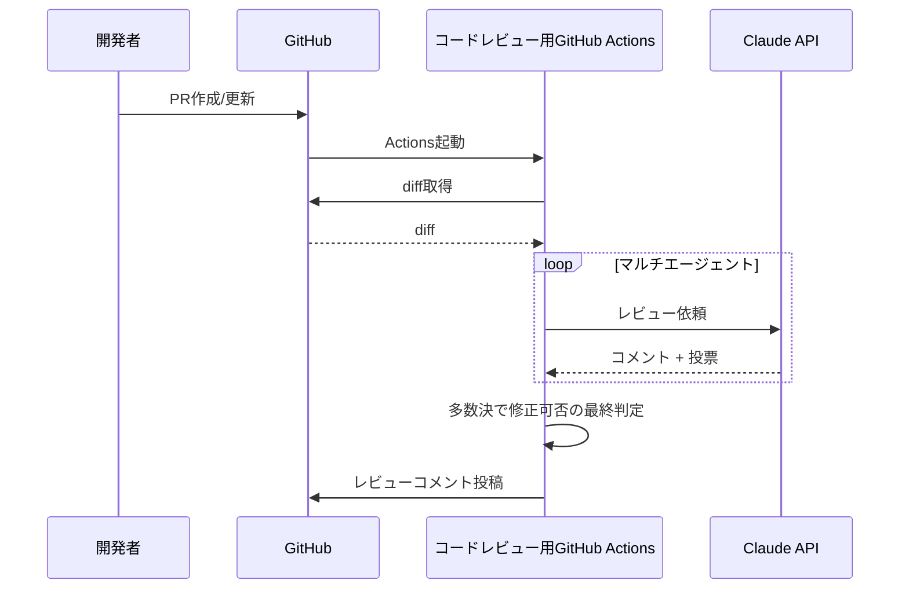

:::note info
この記事は[ラクス Advent Calendar 2025](https://qiita.com/advent-calendar/2025/rakus)の22日目の記事です
:::

# はじめに
最近PHPのRFCを読む機会があったのですが、特定のRFCに対して議論が進む様子や採択が投票で決まる仕組みが面白かったので、コードレビューエージェントにも同じような環境を再現できたら質の高いAIコードレビューを自動化できないか？と思いました。

PHPのRFCの議論の様子


# やったこと

PRに対してレビュワーとして用意されたマルチエージェントが自律的に議論するGitHub Actionsを作りました。

https://github.com/udonrm/pr-review-multi-agent

# 仕組み

## 1. 処理の流れ

ざっくりと以下の流れで運用しています。



PRの作成/更新をトリガーにActionが起動し、マルチエージェントが人間のように議論形式で会話し、最終的に修正が必要かどうかまで自動で結論を出してくれるような構成を目指しました。

## 2. 実装の詳細

### エントリーポイント

https://github.com/udonrm/pr-review-multi-agent/blob/main/src/main.ts

action.ymlに定義した`bun run src/main.ts`が実行されます。
main.tsではレビューフローを管理するReviewOrchestratorを呼び出しています。

### 差分の取得

https://github.com/udonrm/pr-review-multi-agent/blob/main/src/gh/pr.ts

GitHub CLI (`gh`) を使って差分を取得しています。
トークンの節約のため、レビュー対象外ファイルもいくつか定義しました。
取得したdiffはReviewOrchestratorで呼び出され、以下のようなPRの概要と差分情報に整形されます。
Orchestratorはこれを各エージェントのプロンプトとしてClaude APIに送信し、レビューコメントを取得します。
```
## Pull Request: ログイン機能の追加

ユーザー認証機能を実装しました。

## Diff

## src/auth/login.ts (added)
+50 -0
```diff
@@ -0,0 +1,50 @@
+export async function login(email: string, password: string) {
+  const user = await findUser(email);
+  if (!user) throw new Error("User not found");
+  ...
+}
```

### エージェントの定義

https://github.com/udonrm/pr-review-multi-agent/blob/main/src/review/agents.ts

RFCのように活発な議論が起こるように、役割や得意分野が異なる5つのエージェントを用意しました。
一般的に[Role Prompting](https://www.prompthub.us/blog/role-prompting-does-adding-personas-to-your-prompts-really-make-a-difference)と呼ばれている手法です。

RFCのような議論を再現するなら、専門分野だけでなく立場の違いや性格の違いとかも取り入れてみても面白かったかもしれないです。ただ専門家のRole Promptingの方が一般的だと思うので今回は冒険せずに以下としました。

エージェント | 観点 |
|-------------|------|
| 🔒 Security Expert | 脆弱性、認証、入力検証 |
| ⚡ Performance Expert | パフォーマンス、N+1、非同期処理 |
| 📖 Readability Expert | 命名、構造、可読性 |
| 🏗️ Architecture Expert | 設計パターン、モジュール分離 |
| 🧪 Testing Expert | テストカバレッジ、エッジケース

### レビュー実行

https://github.com/udonrm/pr-review-multi-agent/blob/main/src/review/orchestrator.ts

自律的な議論を再現するために、各エージェントが1回目のレビュー→そのレビュー結果をインプットにして2回目のレビューをするようにしています。2回目のレビューでは他のエージェントの指摘に対して賛成か反対かを理由付きで表明させています。

はじめは初回レビューを並列で実行していたのですが、APIのレートリミットに引っかかってしまったためやむをえず直列実行に変更しました。自分の環境だと1分間のinput tokenが30,000に制限されていたようです。GitHub Actionsの失敗履歴は以下↓

https://github.com/udonrm/pr-review-sandbox/actions/runs/20409800522/job/58644878667#step:2:85

2周目のレビューでは1回目のレビュー結果をインプットとして受け取っています。

```ts
const initialReviews = await this.runInitialReviews(context, diffContent);
        .
        .
        .
const discussions = await this.runDiscussionRound(initialReviews);
```

スキーマとして以下のように表現しました。

```ts
const DISCUSSION_SCHEMA = {
  type: "object",
  properties: {
    responses: {
      type: "array",
      items: {
        type: "object",
        properties: {
          expert: { type: "string" },
          stance: { type: "string", enum: ["agree", "disagree"] },
          reason: { type: "string" },
        },
        required: ["expert", "stance", "reason"],
      },
    },
    finalVote: { type: "string", enum: ["APPROVE", "REQUEST_CHANGES"] },
    finalReasoning: { type: "string" },
  },
};
```

### レビュー結果のまとめ

RFCのように多数決で修正可否を判定させたかったので、レビュー終了後に指摘毎に投票結果をまとめるようにしました。

https://github.com/udonrm/pr-review-multi-agent/blob/main/src/gh/comments.ts
